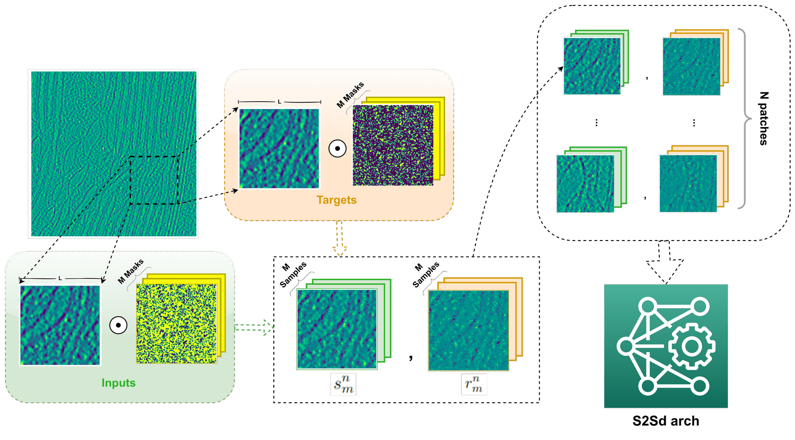
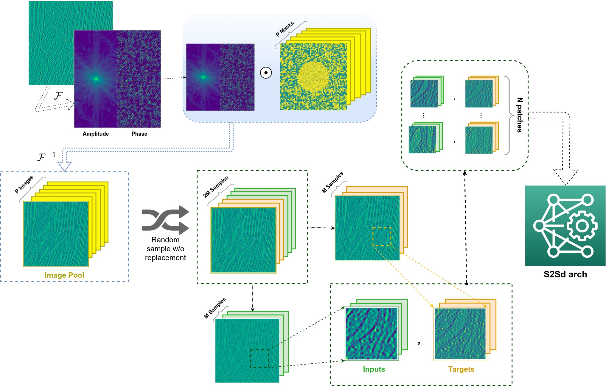

# Denoising of cryo-electron tomograms and its effect on cellular membrane segmentation performance. <!-- omit in toc --> 

- [1. Main ideas](#1-main-ideas)
  - [1.1. Example of usage](#11-example-of-usage)
- [2. TODO: abstract](#2-todo-abstract)
- [3. Installation](#3-installation)
- [4. Implementation](#4-implementation)
  - [4.1. Real space sampling](#41-real-space-sampling)
  - [4.2. Fourier space sampling](#42-fourier-space-sampling)
- [5. Results and next steps](#5-results-and-next-steps)

## 1. Main ideas

This is the repo for my Master Thesis from my M. Sc. in Mathematics at TUM. The main idea of my work was to **explore denoising techniques to enhace visualization of cryo-electron tomograms (CET) using Deep Learning**. In the CET setting, no ground truth data is available and therefore the denoising exploration was made using two separate ways. One way implements a current denoising network based on [self-supervised learning and dropout](https://openaccess.thecvf.com/content_CVPR_2020/html/Quan_Self2Self_With_Dropout_Learning_Self-Supervised_Denoising_From_Single_Image_CVPR_2020_paper.html). The other was is a proposed mechanism that implements sampling in Fourier space to generate different versions of the noisy image which are to some degree independent and which can then be mapped under the [Noise2Noise](https://arxiv.org/abs/1803.04189) paradigm. I believe that this last implementation can be further developed to achieve significantly better denoising results because only a single CET reconstruction is needed to achieve denoising. 

One very interesting line for further development would be to apply the present method to Fluorescent Microscopy images, where no ground truth nor second noisy images can be obtained.

First part of the Readme is a small description of my work, followed by installation of packages used to run the code. Then I describe some details on the implementation. Afterwards, some of my results are described. And finally possible next steps for anyone interested.

The implemented denoising network is based on the U-net as follows:

3D implementation of the network based on the U-net used to map noisy volumes to denoised outputs. Blue boxes are part of the encoding path; red ones are used for the decoding path.

### 1.1. Example of usage

A sample script for denoising images using the proposed Fourier sampling strategy (described below) can be found [here](https://github.com/Fickincool/master-thesis/blob/cet_denoising/scripts/denoisingUnet_training/run_training_experiment.py)

## 2. TODO: abstract

## 3. Installation 

[Install Miniconda](https://docs.conda.io/en/latest/miniconda.html), then add some channels thet are important for conda installation by running:

`conda config --add channels pytorch,simpleitk,anaconda,conda-forge`

Afterwards, **from this folder** run

`conda create --name <yourEnvNameHere> --file master-thesis/requirements_S2SdDenoising.txt`

Finally, install some code I developed for my use case:

`cd cryoS2Sdrop; pip install --editable ./`
`cd tomoSegmentPipeline; pip install --editable ./`

## 4. Implementation

### 4.1. Real space sampling

Workflow to obtain an input batch using Bernoulli samples in real space. First, a square subtomogram, $\hat{x}_n$, of side $L$ is extracted from the input CET image. Then, a set of $M$ Bernoulli masks for patch $n$ is obtained. Each member in the mask has a probability of success equal to $p$. Each mask and its complement are multiplied pointwise by the subtomogram to obtain a set of $M$ inputs and targets, shown in dotted green and orange boxes, respectively. This process is repeated for $N$ different patches, each time with a new set of random masks, to obtain one training batch.

In this setting we are mapping randomly zeroed out pixels and using the surrounding pixels to predict them.

**Inference**

In order to get the denoised version of the tomogram, the trained network is used **with dropout on** on each of the overlapping patches that form the image. A new version of the network,  with parameters $\theta_n$, was used on new Bernoulli samples. We used one new network per Bernoulli sample to maximize independence in the predictions. More specifically, prediction for the $p$-th patch, $z_p$, is given by:

$$z_p = \frac{1}{N} \sum_n f_{\theta_n} (b_{M+n}^p \odot \hat{x}_p)$$

### 4.2. Fourier space sampling

Workflow to obtain an input batch using Bernoulli samples in Fourier space. First, the Fourier transform of the input image, $\mathcal{F}(\hat{x})$, is calculated. Then, Bernoulli masks and the inverse Fourier transform are used to obtain a fixed pool of images that will be sampled without replacement for each patch. The first half of the samples are used to obtain the input patch and the last half to obtain the target patch, shown in green and orange, respectively. This process is repeated for $N$ patches.

**Inference**

The final denoised image is obtained by predicting the individual patches of the input image and averaging in a similar fashion as described for the real space strategy. More specifically, to predict one patch $p$, we start by selecting that patch and then obtaining $K$ versions of it from a random subset of size $K$ from the image pool, each version of the patch is denoted by $p_k$. We use the network with dropout turned on to generate $K$ different versions of predictions for the patch, denoted as $f_{\theta^*_t}(p_k)$, where $\theta^*_nt$ denotes a subset of the parameters of the trained network at iteration $n$. We then repeat this process $T$ times to obtain the denoised patch $z$ by averaging the predictions. Or, more succinctly:

$$z = \frac{1}{K \cdot T} \sum_k \sum_t f_{\theta^*_t}(p_k)$$

and we repeat this process for each patch of the image. Taking the average of the denoised patches whenever there is overlap between them.

## 5. Results and next steps

This can be consulted more thoroughly on the final manuscript of [my Master Thesis]() (TODO)
